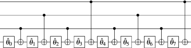
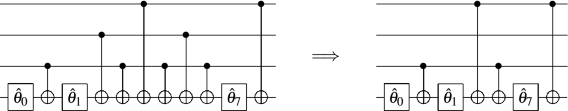
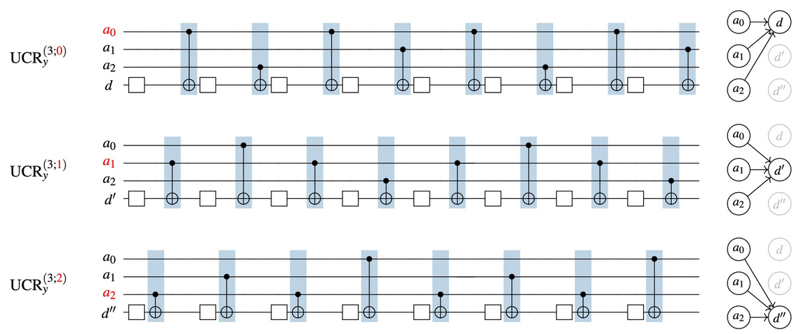
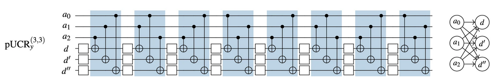

# Quantum Image Processing
A series of python modules for implementing Quantum Image and Signal Processing protocols for image encoding, which fulfills the challenge "Preparing for Battle".


The report goes through several embedding schemes we have come up with that are either good for simulating (simulator friendly encodings) and NISQ friendly hardware friendly. 
The main feature is that we have implemented an embedding in qiskit for the FRQI-QPIXL framework  (Amankwah et al., May 2022, https://www.nature.com/articles/s41598-022-11024-y ). 
This is included in two folders, one for a qiskit version and another for a pennylane version.  ```qpixl.py``` for the full version with compression, and  ```param_qpixl.py``` contains the parameterized version that can be used to generate a NISQ friendly image feature map for QML amongst other things.

- Contents
    - Introduction
    - QPIXL (```QPIXL.ipynb```)
    - compression
    - Implement multiple images in the same circuit

# QPIXL


## Introduction

### Quantum killers for NISQ
The depth (and connectivity) of a circuit completely determines how well it can be implemented on existing hardware. The killing blow to most
algorithms is that they require fully connected and very deep circuits (which get decomposed to even deeper circuits with limited gatesets). 
Due to non-zero error rates, the probability that at least an error has occured throughout the run of a circuit eventually becomes 1. This can
be mitigated, but at some point it can't be done. This is why short circuits for flexible data embeddings are so important.

### Images in quantum computing
Although quantum computers have a more obvious to see advantage in quantum tasks, nonetheless it is thought that we can see some advantages in tasks involving
classical data loaded onto a quantum computer. Although pictures may not be 'the' data-type that will see an advantage from quantum computing, it is nonetheless 
the case that a lot of data can be input in an image-like format, and studying pictoral algorihtms is definitely way easier on the eyes than pure data-driven tasks! 
Also, with a quantum state representing an image, you can see the results of any quantum transformation of the picture as a new picture! Of course, it needs to be 
seen from many 'angles', but maybe it can help with visualizing what 

## QPIXL algorithm

Why do we need another type of embedding in the mix? QPIXL is a framework to decompose popular image encodings such as FRQI, NEQR and their improved counterparts. 
It works by optimally decomposing the gates, and removing any 0 angles that are found. Thanks to the optimal decomposition
the quantum gates can then be further reduced by removing pairs of CNOTS that used to be interweaved by rotation gates. 
They cancel out an become the identity. 
The FRQI embedding looks as follows: 


but decomposed into CNOTS and rotations it looks like this! 


With QPIXL, the basic embedding, after transforming the image into an angle representation (using arctangent on the pixel values and a walsh hadamard transform) you have this much shorter decomposition! 
And this implies that we encode each of its elements into the amplitudes of the wave function.



## Compression
If you set the angles 2-6 to 0 (or if they are already 0), you get something that looks like this! The 0 angle rotations are the identity, and 'disappear', and the remaining the pairs of CNOTS cancelling out :O




So you can greatly compress the depth up to some percentage (treshold at which you set angles to 0). What does this look like? See the image below 

For a simple image that is hopefully familiar 


And a more complex image


This lets you see by how much you can compress an image and still retain a high level of detail, obviously finer features disappear the more compression you add, much like traditional JPEG compression. 


## Implement multiple images in the same circuit

Moreover, a extension of QPIXL, QCrank, is developed and published this year, which encodes a series of real-valued data as rotations on data qubits
(Balewski, J., Amankwah, M.G., Van Beeumen, R. et al., Sci Rep 14, 3435 (2024), https://doi.org/10.1038/s41598-024-53720-x). 
That is to say, multiple data encoding in one qubit is possble.
The QCrank method looks as follow:



In this example, a cyclic permuted UCRs for 3 address and 1 data qubits is shown.
As a result, 3 different permutations acting on 3 data qubits can be reordered to an equivalent circuit with the same critical depth as a single circuit operating on 1 data qubit.



